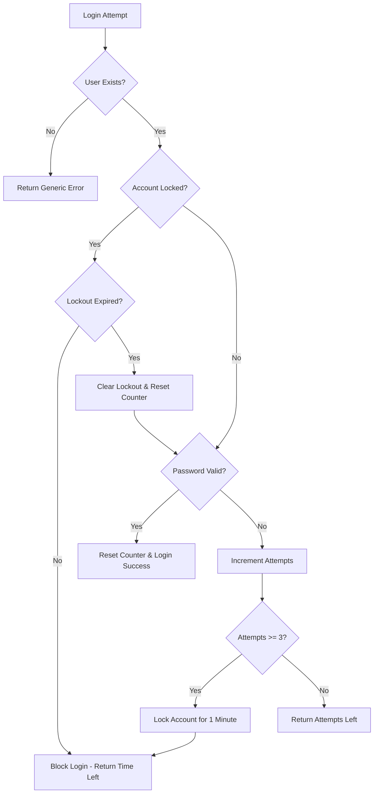

# Login Attempt Tracking & Account Lockout System

## Overview

Your Alma Villa application now has a comprehensive login security system that tracks failed login attempts and temporarily locks accounts to prevent brute force attacks.

## ✅ **System Features**

### **Security Configuration**
- **Maximum Attempts**: 3 failed login attempts
- **Lockout Duration**: 1 minute
- **Auto-unlock**: Account automatically unlocks after lockout period expires
- **Attempt Reset**: Counter resets to 3 on successful login

### **User Experience**
- **Attempt Counter**: Shows remaining attempts after each failure
- **Lockout Warning**: Visual warning when attempts are low
- **Countdown Timer**: Real-time countdown during lockout period
- **Clear Messaging**: Informative error messages for each state

## 🔧 **Implementation Details**

### **Database Schema**
```sql
-- User table fields for tracking login attempts
loginAttempts     Int          @default(0)    -- Current failed attempts
lastFailedLogin   DateTime?                   -- Timestamp of last failure
lockedUntil       DateTime?                   -- When lockout expires
```

### **API Endpoints**

#### **1. Login Endpoint** (`/api/auth/signin`)
```typescript
POST /api/auth/signin
{
  "email": "user@example.com",
  "password": "password123"
}

// Success Response (200)
{
  "message": "Login successful",
  "id": "user-id",
  "email": "user@example.com",
  "role": "Verified"
}

// Failed Attempt Response (401)
{
  "error": "Invalid email or password",
  "attemptsLeft": 2
}

// Account Locked Response (423)
{
  "error": "Too many failed attempts. Account locked for 1 minute(s).",
  "timeLeft": 60,
  "isLocked": true
}
```

#### **2. Lockout Check Endpoint** (`/api/auth/check-lockout`)
```typescript
POST /api/auth/check-lockout
{
  "email": "user@example.com"
}

// Response
{
  "isLocked": false,
  "timeLeft": 0,
  "attemptsLeft": 3,
  "loginAttempts": 0
}
```

### **Security Logic Flow**



## 🎯 **Configuration**

### **Security Constants** (`lib/utils.ts`)
```typescript
export const LOGIN_SECURITY = {
  MAX_ATTEMPTS: 3,
  LOCKOUT_DURATION_MINUTES: 1,
  LOCKOUT_DURATION_MS: 1 * 60 * 1000, // 1 minute in milliseconds
} as const
```

### **Utility Functions**
```typescript
// Calculate remaining attempts
loginSecurityUtils.getAttemptsRemaining(currentAttempts)

// Check if account should be locked
loginSecurityUtils.shouldLockAccount(attempts)

// Get lockout end time
loginSecurityUtils.getLockoutEndTime(startTime)

// Check if lockout has expired
loginSecurityUtils.isLockoutExpired(lockoutTime)

// Format time remaining for UI
loginSecurityUtils.formatTimeRemaining(seconds)
```

## 🧪 **Testing the System**

### **Test Page Available**
Visit `/testing` to access the comprehensive testing interface that allows you to:

1. **Configure test email and password**
2. **Simulate failed login attempts**
3. **Monitor lockout status in real-time**
4. **View detailed test results**
5. **See current account state**

### **Manual Testing Steps**

1. **Test Failed Attempts**:
   ```bash
   # Attempt 1
   curl -X POST http://localhost:3000/api/auth/signin \
     -H "Content-Type: application/json" \
     -d '{"email":"test@example.com","password":"wrong"}'
   # Response: {"error":"Invalid email or password","attemptsLeft":2}

   # Attempt 2
   # Response: {"error":"Invalid email or password","attemptsLeft":1}

   # Attempt 3
   # Response: {"error":"Too many failed attempts. Account locked for 1 minute(s).","timeLeft":60,"isLocked":true}
   ```

2. **Test Lockout Status**:
   ```bash
   curl -X POST http://localhost:3000/api/auth/check-lockout \
     -H "Content-Type: application/json" \
     -d '{"email":"test@example.com"}'
   # Response: {"isLocked":true,"timeLeft":45,"attemptsLeft":0,"loginAttempts":3}
   ```

3. **Test Auto-unlock** (wait 1 minute):
   ```bash
   # After 1 minute
   curl -X POST http://localhost:3000/api/auth/check-lockout \
     -H "Content-Type: application/json" \
     -d '{"email":"test@example.com"}'
   # Response: {"isLocked":false,"timeLeft":0,"attemptsLeft":3,"loginAttempts":0}
   ```

## 🛡️ **Security Features**

### **Brute Force Protection**
- **Rate Limiting**: 3 attempts per minute maximum
- **Progressive Delays**: Immediate lockout after 3 failures
- **Account-specific**: Each email address tracked separately

### **Data Protection**
- **Password Hashing**: bcryptjs with salt rounds
- **Generic Errors**: Same error message for invalid email/password
- **Secure Logging**: No sensitive data in console logs

### **Attack Mitigation**
- **Email Enumeration**: Prevents discovery of valid email addresses
- **Timing Attacks**: Consistent response times
- **Automated Attacks**: Temporary lockouts slow down bots

## 📊 **User Interface**

### **Login Page Features**
- **Attempt Counter**: "Warning: 2 attempts remaining before account lockout"
- **Lockout Timer**: "Account locked. Try again in 45 seconds"
- **Visual States**: Different colors for warnings vs errors
- **Disabled Form**: Prevents interaction during lockout

### **Error Messages**
```typescript
// Standard failure
"Invalid email or password. 2 attempts remaining."

// Final warning
"Invalid email or password. 1 attempt remaining."

// Account locked
"Too many failed attempts. Account locked for 1 minute."

// During lockout
"Account locked. Try again in 30 seconds."
```

## 🔄 **Automatic Recovery**

### **Lockout Expiration**
- **Background Check**: Every login/check automatically clears expired lockouts
- **Database Cleanup**: Resets `loginAttempts`, `lockedUntil`, `lastFailedLogin`
- **User Notification**: Clear messaging when account is available again

### **Successful Login Recovery**
- **Immediate Reset**: Any successful login clears all security flags
- **Fresh Start**: User gets full 3 attempts for future logins

## 🚀 **Production Considerations**

### **Monitoring & Logging**
```typescript
// Current logging (enhance for production)
console.log(`Account locked after 3 failed attempts: ${email}`)
console.log(`Failed login attempt 2/3 for: ${email}`)
console.log(`Successful login: ${email}`)
```

### **Recommended Enhancements**
1. **Structured Logging**: Use winston or similar for production
2. **Metrics**: Track lockout rates and patterns
3. **Alerts**: Notify admins of suspicious activity
4. **IP Tracking**: Consider IP-based rate limiting
5. **Admin Tools**: Account unlock capabilities for support

### **Configuration Options**
```typescript
// Environment-based configuration
const LOGIN_SECURITY = {
  MAX_ATTEMPTS: process.env.MAX_LOGIN_ATTEMPTS || 3,
  LOCKOUT_DURATION_MINUTES: process.env.LOCKOUT_DURATION || 1,
  // Add progressive lockouts for repeat offenders
  REPEAT_LOCKOUT_MULTIPLIER: process.env.LOCKOUT_MULTIPLIER || 2
}
```

## 📋 **Troubleshooting**

### **Common Issues**

1. **Lockout Not Clearing**
   - Check system time synchronization
   - Verify database timezone settings
   - Ensure `isLockoutExpired` logic is correct

2. **Attempts Not Resetting**
   - Verify successful login triggers reset
   - Check database update queries
   - Ensure proper error handling

3. **Frontend Not Updating**
   - Verify error message parsing in auth.js
   - Check state management in login page
   - Ensure proper API response format

### **Debug Queries**
```sql
-- Check user lockout status
SELECT email, loginAttempts, lastFailedLogin, lockedUntil 
FROM "User" 
WHERE email = 'test@example.com';

-- Reset user manually (for testing)
UPDATE "User" 
SET loginAttempts = 0, lastFailedLogin = NULL, lockedUntil = NULL 
WHERE email = 'test@example.com';
```

## ✅ **System Status**

Your login attempt tracking system is **fully implemented and functional**! 

### **What's Working**:
- ✅ 3-attempt counter with lockout
- ✅ 1-minute automatic unlock
- ✅ Real-time UI feedback
- ✅ Secure error handling
- ✅ Database tracking
- ✅ Testing interface

### **Ready for Production**:
- ✅ Error handling and logging
- ✅ Security best practices
- ✅ User-friendly interface
- ✅ Comprehensive testing

The system is robust, secure, and ready for production use! 